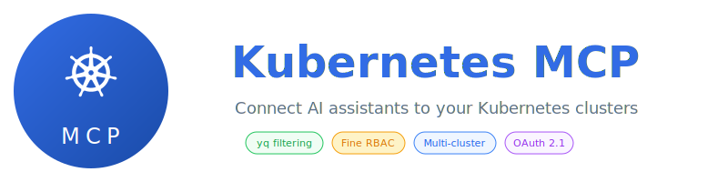

<p align="center">
  
</p>

<p align="center">
  
  
  
</p>

<p align="center">
  <a href="http://youtube.com/achetronic"></a>
  <a href="http://github.com/achetronic"></a>
  <a href="https://twitter.com/achetronic"></a>
</p>

## Why Kubernetes MCP?

AI assistants are powerful, but they struggle with Kubernetes because:

- **Context window limits**: A single `kubectl get pods -A` can blow your token budget
- **Security concerns**: You don't want AI deleting your production database
- **Multi-cluster complexity**: Jumping between clusters is error-prone

## Features

<details>
<summary><strong>🎯 25 Kubernetes Tools</strong></summary>

Full cluster management through natural language:

| Category            | Tools                                                                            |
| ------------------- | -------------------------------------------------------------------------------- |
| **Read**            | `get_resource`, `list_resources`, `describe_resource`                            |
| **Modify**          | `apply_manifest`, `patch_resource`, `delete_resource`, `delete_resources`        |
| **Scale & Rollout** | `scale_resource`, `get_rollout_status`, `restart_rollout`, `undo_rollout`        |
| **Debug**           | `get_logs`, `exec_command`, `list_events`                                        |
| **Cluster Info**    | `get_cluster_info`, `list_api_resources`, `list_api_versions`, `list_namespaces` |
| **Context**         | `get_current_context`, `list_contexts`, `switch_context`                         |
| **RBAC & Metrics**  | `check_permission`, `get_pod_metrics`, `get_node_metrics`                        |
| **Diff**            | `diff_manifest`                                                                  |

</details>

<details>
<summary><strong>🔍 Context-Window-Friendly Filtering</strong></summary>

All tools support **yq expressions** to filter responses before they reach your AI. Just ask naturally:

> "Get the image of the my-app deployment"

The AI automatically uses filtering to return just `nginx:1.25` instead of 200+ lines of YAML — saving your context window for what matters.

Complex queries work too:

> "List all running pods with their IPs"

Behind the scenes, the AI chains multiple yq expressions to filter and transform the response.

</details>

<details>
<summary><strong>🔐 Advanced RBAC with CEL</strong></summary>

Fine-grained access control using CEL expressions — filter by **tools**, **contexts**, **API groups**, **kinds**, **namespaces**, and **resource names**:

```yaml
authorization:
  policies:
    # SRE team: full access everywhere
    - name: "sre-admins"
      match:
        expression: 'payload.groups.exists(g, g == "sre-team")'
      allow:
        tools: ["*"]
        contexts: ["*"]
        resources:
          - groups: ["*"]
            kinds: ["*"]

    # Developers: read-only, no secrets, only their namespaces
    - name: "developers-limited"
      match:
        expression: 'payload.groups.exists(g, g == "developers")'
      allow:
        tools: ["get_*", "list_*", "describe_*"]
        contexts: ["*"]
        resources:
          - groups: ["", "apps", "networking.k8s.io"]
            kinds: ["*"]
            namespaces: ["team-*"]
      deny:
        resources:
          - groups: [""]
            kinds: ["Secret"]
          - groups: ["rbac.authorization.k8s.io"]
            kinds: ["*"]
```

</details>

<details>
<summary><strong>🌐 Multi-Cluster Support</strong></summary>

Manage multiple clusters with independent configurations:

```yaml
kubernetes:
  default_context: "staging"
  contexts:
    production:
      kubeconfig: "/etc/kubernetes/prod.kubeconfig"
      description: "Production - handle with care"
      denied_namespaces: ["kube-system", "istio-system"]

    staging:
      kubeconfig: "/etc/kubernetes/staging.kubeconfig"
      description: "Staging - safe for testing"

    development:
      kubeconfig: "/etc/kubernetes/dev.kubeconfig"
      description: "Development - experiment freely"
```

</details>

<details>
<summary><strong>🛡️ Enterprise-Ready Security</strong></summary>

- **OAuth 2.1 compliant** with RFC 8414 and RFC 9728 endpoints
- **JWT validation**: Local (JWKS) or external (Istio/Envoy)
- **Namespace allow/deny lists** per cluster
- **Access logs** with header redaction

</details>

---

## Quick Start

### Option 1: Claude Desktop (Local Binary)

**1. Download the binary:**

```bash
# Linux
curl -L https://github.com/achetronic/kubernetes-mcp/releases/latest/download/kubernetes-mcp-linux-amd64.tar.gz | tar xz

# macOS (Intel)
curl -L https://github.com/achetronic/kubernetes-mcp/releases/latest/download/kubernetes-mcp-darwin-amd64.tar.gz | tar xz

# macOS (Apple Silicon)
curl -L https://github.com/achetronic/kubernetes-mcp/releases/latest/download/kubernetes-mcp-darwin-arm64.tar.gz | tar xz
```

**2. Create config file:**

```yaml
# ~/.config/kubernetes-mcp/config.yaml
server:
  name: "Kubernetes MCP"
  version: "0.1.0"
  transport:
    type: "stdio"

middleware:
  jwt:
    enabled: false

kubernetes:
  default_context: "default"
  contexts:
    default:
      kubeconfig: "" # Uses ~/.kube/config
      description: "Local cluster"

authorization:
  allow_anonymous: true
  policies:
    - name: "allow-all"
      match:
        expression: "true"
      allow:
        tools: ["*"]
        contexts: ["*"]
```

**3. Configure Claude Desktop:**

Edit `claude_desktop_config.json`:

```json
{
  "mcpServers": {
    "kubernetes": {
      "command": "/path/to/kubernetes-mcp",
      "args": ["--config", "/path/to/config.yaml"]
    }
  }
}
```

**4. Restart Claude Desktop** and start managing your clusters!

---

### Option 2: Docker

**1. Create a config file:**

```yaml
# config.yaml
server:
  name: "Kubernetes MCP"
  version: "0.1.0"
  transport:
    type: "http"
    http:
      host: ":8080"

middleware:
  jwt:
    enabled: false

kubernetes:
  default_context: "default"
  contexts:
    default:
      kubeconfig: "/root/.kube/config"
      description: "My Kubernetes cluster"

authorization:
  allow_anonymous: true
  policies:
    - name: "allow-all"
      match:
        expression: "true"
      allow:
        tools: ["*"]
        contexts: ["*"]
```

**2. Run with Docker:**

```bash
docker run -d \
  --name kubernetes-mcp \
  -p 8080:8080 \
  -v ~/.kube/config:/root/.kube/config:ro \
  -v $(pwd)/config.yaml:/config.yaml:ro \
  ghcr.io/achetronic/kubernetes-mcp:latest \
  --config /config.yaml
```

**3. Test it:**

```bash
curl http://localhost:8080/health
```

---

### Option 3: Kubernetes with Helm

We use [bjw-s/app-template](https://github.com/bjw-s-labs/helm-charts/tree/main/charts/other/app-template) directly — a popular generic Helm chart that avoids reinventing the wheel. No wrapper chart needed.

```bash
# Add the bjw-s repository
helm repo add bjw-s https://bjw-s-labs.github.io/helm-charts
helm repo update

# Download our values file and install
curl -LO https://raw.githubusercontent.com/achetronic/kubernetes-mcp/master/chart/values.yaml
helm install kubernetes-mcp bjw-s/app-template --version 4.2.0 \
  -f values.yaml -n kubernetes-mcp --create-namespace
```

Edit `values.yaml` to configure your environment. See [chart/values.yaml](./chart/values.yaml) for all options.

---

## Configuration Reference

### Complete Example

```yaml
# MCP Server Configuration
server:
  name: "Kubernetes MCP"
  version: "0.1.0"
  transport:
    type: "http" # or "stdio"
    http:
      host: ":8080"

# Middleware Configuration
middleware:
  access_logs:
    excluded_headers:
      - X-Request-Id
    redacted_headers:
      - Authorization
      - X-Validated-Jwt

  jwt:
    enabled: true
    validation:
      strategy: "local" # "local" or "external"
      forwarded_header: "X-Validated-Jwt"
      local:
        jwks_uri: "https://keycloak.example.com/realms/mcp/protocol/openid-connect/certs"
        cache_interval: "10s"
        allow_conditions:
          - expression: "has(payload.email)"

# OAuth Configuration (optional, for remote clients)
oauth_authorization_server:
  enabled: true
  issuer_uri: "https://keycloak.example.com/realms/mcp"

oauth_protected_resource:
  enabled: true
  resource: "https://kubernetes-mcp.example.com/mcp"
  auth_servers:
    - "https://keycloak.example.com/realms/mcp"
  scopes_supported: [openid, profile, email, groups]

# Kubernetes Configuration
kubernetes:
  default_context: "production"
  contexts:
    production:
      kubeconfig: "/etc/kubernetes/prod.kubeconfig"
      description: "Production cluster"
      allowed_namespaces: [] # Empty = all allowed
      denied_namespaces:
        - kube-system
        - kube-public
        - istio-system

    staging:
      kubeconfig: "/etc/kubernetes/staging.kubeconfig"
      description: "Staging cluster"

  tools:
    bulk_operations:
      max_resources_per_operation: 100

# Authorization Configuration
authorization:
  allow_anonymous: false
  identity_claim: "email"
  policies:
    - name: "sre-full-access"
      description: "SRE team has full access"
      match:
        expression: 'payload.groups.exists(g, g == "sre-team")'
      allow:
        tools: ["*"]
        contexts: ["*"]

    - name: "developers-limited"
      description: "Developers: full in staging, read-only in prod"
      match:
        expression: 'payload.groups.exists(g, g == "developers")'
      allow:
        tools: ["*"]
        contexts: ["staging"]
      deny:
        tools: ["delete_resource", "delete_resources", "exec_command"]
        contexts: ["production"]
```

### Environment Variables

All config values support environment variable expansion:

```yaml
kubernetes:
  contexts:
    production:
      kubeconfig: "$PROD_KUBECONFIG" # Expanded at runtime
```

### JWT Validation Strategies

| Strategy   | Use Case                                                                         |
| ---------- | -------------------------------------------------------------------------------- |
| `external` | JWT validated by proxy (Istio, Envoy). MCP reads claims from forwarded header    |
| `local`    | MCP validates JWT using JWKS URI. Supports CEL expressions for claims validation |

### Authorization Policy Evaluation

1. If JWT enabled and no token → **deny** (unless `allow_anonymous: true`)
2. Find **all** policies whose `match` expression is true
3. For each policy: `effective = allow - deny`
4. Final result: **union** of all effective permissions
5. If result allows `tool + context + resource` → **allow**
6. Default: **deny**

**Most permissive wins**: If a user matches multiple policies, they get the union of all permissions.

### Resource-Level Authorization

Control access by **API group**, **kind**, **namespace**, and **name**.

#### Reference

| Field | Example | Behavior when omitted |
|-------|---------|----------------------|
| `groups` | `[""]` (core), `["apps"]`, `["_"]` (virtual) | Any group |
| `versions` | `["v1"]`, `["v1beta1"]` | Any version |
| `kinds` | `["Pod", "Secret"]` | Any kind |
| `namespaces` | `["default"]`, `["team-*"]`, `[""]` (cluster-scoped) | Any namespace + cluster-scoped |
| `names` | `["myapp-*"]`, `["*-config"]` | Any name |

> **Tip**: Omit `versions` unless you need to target a specific API version. Omitting it matches all versions.

#### Wildcards

| Pattern | Meaning |
|---------|---------|
| `*` | Match all |
| `prefix-*` | Starts with |
| `*-suffix` | Ends with |

#### Example: Allow everything except sensitive resources

```yaml
- name: "all-except-sensitive"
  match:
    expression: "true"
  allow:
    tools: ["*"]
    contexts: ["*"]
    resources:
      - groups: ["*"]
        kinds: ["*"]
      - groups: ["_"]
        kinds: ["*"]
  deny:
    resources:
      # Secrets
      - groups: [""]
        kinds: ["Secret"]
      # RBAC
      - groups: ["rbac.authorization.k8s.io"]
        kinds: ["*"]
      # Certificates
      - groups: ["certificates.k8s.io"]
        kinds: ["*"]
      # System namespaces
      - groups: ["*"]
        kinds: ["*"]
        namespaces: ["kube-system", "kube-public"]
```

#### Example: Block Secrets

```yaml
- name: "no-secrets"
  match:
    expression: "true"
  allow:
    tools: ["*"]
    contexts: ["*"]
    resources:
      - groups: ["*"]
        kinds: ["*"]
  deny:
    resources:
      - groups: [""]
        kinds: ["Secret"]
```

#### Example: Read-only, no sensitive resources

```yaml
- name: "read-only-safe"
  match:
    expression: '"developers" in payload.groups'
  allow:
    tools: ["get_resource", "list_resources", "describe_resource", "get_logs"]
    contexts: ["*"]
    resources:
      - groups: ["", "apps", "batch", "networking.k8s.io"]
        kinds: ["*"]
  deny:
    resources:
      - groups: [""]
        kinds: ["Secret"]
      - groups: ["rbac.authorization.k8s.io"]
        kinds: ["*"]
```

#### Example: Write only in team namespaces

```yaml
- name: "write-own-namespaces"
  match:
    expression: '"developers" in payload.groups'
  allow:
    tools: ["apply_manifest", "patch_resource", "delete_resource"]
    contexts: ["staging"]
    resources:
      - groups: ["", "apps"]
        kinds: ["*"]
        namespaces: ["team-*"]
  deny:
    resources:
      - groups: [""]
        kinds: ["Secret"]
```

#### Example: CI/CD service account

```yaml
- name: "cicd-deploy"
  match:
    expression: 'payload.client_id == "ci-cd-service"'
  allow:
    tools: ["apply_manifest", "diff_manifest", "get_resource"]
    contexts: ["production"]
    resources:
      - groups: ["", "apps"]
        kinds: ["Deployment", "Service", "ConfigMap"]
        namespaces: ["app-*"]
```

#### Example: Full admin access

```yaml
- name: "sre-full-access"
  match:
    expression: '"sre" in payload.groups'
  allow:
    tools: ["*"]
    contexts: ["*"]
    resources:
      - groups: ["*"]
        kinds: ["*"]
      - groups: ["_"]  # Virtual MCP resources
        kinds: ["*"]
```

#### Virtual MCP Resources

Tools that don't operate on K8s resources use virtual resources under group `_`:

| Tools | Kind |
|-------|------|
| `list_api_resources`, `list_api_versions` | `APIDiscovery` |
| `get_cluster_info` | `ClusterInfo` |
| `get_current_context`, `list_contexts`, `switch_context` | `Context` |

```yaml
# Allow discovery and context switching
resources:
  - groups: ["_"]
    kinds: ["APIDiscovery", "ClusterInfo", "Context"]
```

---

## Usage Examples

### Ask your AI assistant:

```
"List all pods in the production namespace that are not running"
```

The AI will use:

```yaml
tool: list_resources
version: v1
kind: Pod
namespace: production
yq_expressions:
  - '.items[] | select(.status.phase != "Running") | {name: .metadata.name, phase: .status.phase}'
```

### More examples:

| Request                                                | Tool Used                        |
| ------------------------------------------------------ | -------------------------------- |
| "What's using the most memory in staging?"             | `get_pod_metrics` with yq sort   |
| "Restart the api deployment"                           | `restart_rollout`                |
| "Show me the diff if I change the image to nginx:1.26" | `diff_manifest`                  |
| "Scale the workers to 5 replicas"                      | `scale_resource`                 |
| "Why is the payment pod failing?"                      | `describe_resource` + `get_logs` |
| "Switch to the development cluster"                    | `switch_context`                 |

---

## Development

### Prerequisites

- Go 1.24+
- Access to a Kubernetes cluster
- (Optional) Docker for building images

### Build & Run

```bash
# Build binary
make build

# Run with HTTP transport
make run

# Run with custom config
./bin/kubernetes-mcp-linux-amd64 --config /path/to/config.yaml
```

### Project Structure

```
kubernetes-mcp/
├── cmd/main.go                    # Entrypoint
├── api/config_types.go            # Configuration types
├── internal/
│   ├── k8stools/                  # MCP tools implementation
│   │   ├── manager.go             # Tool registration
│   │   ├── helpers.go             # Shared utilities
│   │   ├── tools_read.go          # get_resource, list_resources, describe_resource
│   │   ├── tools_modify.go        # apply, patch, delete
│   │   ├── tools_scale_rollout.go # scale, rollout operations
│   │   ├── tools_logs_exec.go     # logs, exec, events
│   │   ├── tools_cluster.go       # cluster info, namespaces, api resources
│   │   ├── tools_context.go       # context management
│   │   ├── tools_rbac_metrics.go  # permissions, metrics
│   │   └── tools_diff.go          # manifest diff
│   ├── kubernetes/client.go       # Multi-cluster client manager
│   ├── authorization/evaluator.go # CEL-based RBAC
│   ├── yqutil/evaluator.go        # yq expression processor
│   ├── middlewares/               # JWT, logging middlewares
│   └── handlers/                  # OAuth endpoints
├── docs/
│   ├── config-http.yaml           # HTTP mode example
│   └── config-stdio.yaml          # Stdio mode example
└── chart/                         # Helm chart
```

### Adding a New Tool

1. Create handler in `internal/k8stools/tools_<category>.go`:

```go
func (m *Manager) registerMyTool() {
    tool := mcp.NewTool("my_tool",
        mcp.WithDescription("Does something useful"),
        mcp.WithString("param", mcp.Required(), mcp.Description("A parameter")),
    )
    m.mcpServer.AddTool(tool, m.handleMyTool)
}

func (m *Manager) handleMyTool(ctx context.Context, request mcp.CallToolRequest) (*mcp.CallToolResult, error) {
    args := request.GetArguments()
    // ... implementation
    return successResult("Done!"), nil
}
```

2. Register in `manager.go`:

```go
func (m *Manager) RegisterAll() {
    // ... existing tools
    m.registerMyTool()
}
```

### Running Tests

```bash
# Format and vet
make fmt
make vet

# Lint (auto-installs golangci-lint)
make lint
```

### Building Docker Image

```bash
make docker-build IMG=your-registry/kubernetes-mcp:tag
```

---

## Documentation

- [MCP Specification](https://modelcontextprotocol.io/specification)
- [MCP Authorization](https://modelcontextprotocol.io/specification/2025-06-18/basic/authorization)
- [RFC 9728 - OAuth Protected Resource Metadata](https://datatracker.ietf.org/doc/rfc9728/)
- [mcp-go Library](https://mcp-go.dev/getting-started)
- [CEL Expressions](https://github.com/google/cel-spec)
- [yq Manual](https://mikefarah.gitbook.io/yq/)

---

## Contributing

All contributions are welcome! Whether you're reporting bugs, suggesting features, or submitting code — thank you!

- [Open an issue](https://github.com/achetronic/kubernetes-mcp/issues/new) to report bugs or request features
- [Submit a pull request](https://github.com/achetronic/kubernetes-mcp/pulls) to contribute improvements

---

## License

Kubernetes MCP is licensed under the [Apache 2.0 License](./LICENSE).
