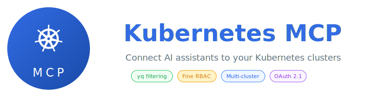

<p align="center">
  
</p>

<p align="center">
  
  
  
</p>

<p align="center">
  <a href="http://youtube.com/achetronic"></a>
  <a href="http://github.com/achetronic"></a>
  <a href="https://twitter.com/achetronic"></a>
</p>

## Why Kubernetes MCP?

AI assistants are powerful, but they struggle with Kubernetes because:

- **Context window limits**: A single `kubectl get pods -A` can blow your token budget
- **Security concerns**: You don't want AI deleting your production database
- **Multi-cluster complexity**: Jumping between clusters is error-prone

## Features

<details>
<summary><strong>🎯 25 Kubernetes Tools</strong></summary>

Full cluster management through natural language:

| Category            | Tools                                                                            |
| ------------------- | -------------------------------------------------------------------------------- |
| **Read**            | `get_resource`, `list_resources`, `describe_resource`                            |
| **Modify**          | `apply_manifest`, `patch_resource`, `delete_resource`, `delete_resources`        |
| **Scale & Rollout** | `scale_resource`, `get_rollout_status`, `restart_rollout`, `undo_rollout`        |
| **Debug**           | `get_logs`, `exec_command`, `list_events`                                        |
| **Cluster Info**    | `get_cluster_info`, `list_api_resources`, `list_api_versions`, `list_namespaces` |
| **Context**         | `get_current_context`, `list_contexts`, `switch_context`                         |
| **RBAC & Metrics**  | `check_permission`, `get_pod_metrics`, `get_node_metrics`                        |
| **Diff**            | `diff_manifest`                                                                  |

All resource-addressing tools take **GVR** parameters: `group` + `version` + `resource` (plural lowercase form, e.g. `pods`, `deployments`, `ingresses`, `storageclasses`). NOT the Kind. The two manifest tools (`apply_manifest`, `diff_manifest`) parse `apiVersion`/`kind` from the YAML and resolve the GVR via the cluster's discovery API, so CRDs and irregular plurals work transparently.

Built-in safety rails:

- `apply_manifest` rejects multi-document YAML and reports `created` vs `updated`.
- `delete_resources` requires either `namespace` or an explicit `all_namespaces=true` (mutually exclusive), and refuses to delete more than `kubernetes.tools.bulk_operations.max_resources_per_operation` items per call (default 100).
- `get_logs` truncates output at 1 MiB; `exec_command` is non-interactive, supports a configurable `timeout_seconds` (1..300, default 30) and caps stdout+stderr at 1 MiB.
- `restart_rollout` / `undo_rollout` only operate on `apps/{deployments,statefulsets,daemonsets}`; `undo_rollout` defaults to N-1 (kubectl-compatible) and reads ReplicaSet history for Deployments / ControllerRevisions for StatefulSets and DaemonSets.

</details>

<details>
<summary><strong>🔍 Context-Window-Friendly Filtering</strong></summary>

All tools support **yq expressions** to filter responses before they reach your AI. Just ask naturally:

> "Get the image of the my-app deployment"

The AI automatically uses filtering to return just `nginx:1.25` instead of 200+ lines of YAML — saving your context window for what matters.

Complex queries work too:

> "List all running pods with their IPs"

Behind the scenes, the AI chains multiple yq expressions to filter and transform the response.

</details>

<details>
<summary><strong>🔐 Advanced RBAC</strong></summary>

Fine-grained access control with rules-based policies — filter by **tools**, **contexts**, **API groups**, **resources** (plural GVR), **namespaces**, and **resource names**. Deny always wins, default deny, full glob support. See [Authorization](#authorization-policy-evaluation) for details and examples.

</details>

<details>
<summary><strong>🌐 Multi-Cluster Support</strong></summary>

Manage multiple clusters with independent configurations:

```yaml
kubernetes:
  default_context: "staging"
  contexts:
    - name: "production"
      kubeconfig: "/etc/kubernetes/prod.kubeconfig"
      description: "Production - handle with care"
      denied_namespaces: ["kube-system", "istio-system"]

    - name: "staging"
      kubeconfig: "/etc/kubernetes/staging.kubeconfig"
      description: "Staging - safe for testing"

    - name: "development"
      kubeconfig: "/etc/kubernetes/dev.kubeconfig"
      description: "Development - experiment freely"

  # Or auto-load from directory (context name = current-context of each file)
  contexts_dir: "/etc/kubernetes/clusters/"
```

**Hot-reload**: Kubeconfig files are watched for changes. When a sidecar or external process updates a kubeconfig, the client is automatically reloaded — no restart required.

</details>

<details>
<summary><strong>🛡️ Enterprise-Ready Security</strong></summary>

- **OAuth 2.1 compliant** with RFC 8414 and RFC 9728 endpoints
- **JWT validation** with JWKS and CEL-based claim conditions
- **API key authentication** with static tokens and configurable payloads
- **Namespace allow/deny lists** per cluster
- **Access logs** with header redaction

</details>

---

## Quick Start

### Option 1: Claude Desktop (Local Binary)

**1. Download the binary:**

```bash
# Linux
curl -L https://github.com/achetronic/kubernetes-mcp/releases/latest/download/kubernetes-mcp-linux-amd64.tar.gz | tar xz

# macOS (Intel)
curl -L https://github.com/achetronic/kubernetes-mcp/releases/latest/download/kubernetes-mcp-darwin-amd64.tar.gz | tar xz

# macOS (Apple Silicon)
curl -L https://github.com/achetronic/kubernetes-mcp/releases/latest/download/kubernetes-mcp-darwin-arm64.tar.gz | tar xz
```

**2. Create config file:**

```yaml
# ~/.config/kubernetes-mcp/config.yaml
server:
  name: "Kubernetes MCP"
  version: "0.1.0"
  transport:
    type: "stdio"

middleware:
  jwt:
    enabled: false

kubernetes:
  default_context: "default"
  contexts:
    - name: "default"
      kubeconfig: "" # Empty: $KUBECONFIG -> ~/.kube/config -> in-cluster
      description: "Local cluster"
  discovery:
    refresh_interval: "10m"

authorization:
  allow_anonymous: true
  policies:
    - name: "allow-all"
      match:
        expression: "true"
      rules:
        - effect: allow
          tools: ["*"]
          contexts: ["*"]
          resources:
            - groups: ["*"]
              resources: ["*"]
            - groups: ["_"]
              resources: ["*"]
```

**3. Configure Claude Desktop:**

Edit `claude_desktop_config.json`:

```json
{
  "mcpServers": {
    "kubernetes": {
      "command": "/path/to/kubernetes-mcp",
      "args": ["--config", "/path/to/config.yaml"]
    }
  }
}
```

**4. Restart Claude Desktop** and start managing your clusters!

---

### Option 2: Docker

**1. Create a config file:**

```yaml
# config.yaml
server:
  name: "Kubernetes MCP"
  version: "0.1.0"
  transport:
    type: "http"
    http:
      host: ":8080"

middleware:
  jwt:
    enabled: false

kubernetes:
  default_context: "default"
  contexts:
    - name: "default"
      kubeconfig: "/root/.kube/config"
      description: "My Kubernetes cluster"
  discovery:
    refresh_interval: "10m"

authorization:
  allow_anonymous: true
  policies:
    - name: "allow-all"
      match:
        expression: "true"
      rules:
        - effect: allow
          tools: ["*"]
          contexts: ["*"]
          resources:
            - groups: ["*"]
              resources: ["*"]
            - groups: ["_"]
              resources: ["*"]
```

**2. Run with Docker:**

```bash
docker run -d \
  --name kubernetes-mcp \
  -p 8080:8080 \
  -v ~/.kube/config:/root/.kube/config:ro \
  -v $(pwd)/config.yaml:/config.yaml:ro \
  ghcr.io/achetronic/kubernetes-mcp:latest \
  --config /config.yaml
```

**3. Test it:**

The MCP server exposes the protocol under `/mcp` (POST, JSON-RPC) and OAuth
discovery under `/.well-known/oauth-*` when those are enabled. There is no
plain `/health` endpoint; verify the server is up by issuing the MCP
`initialize` handshake:

```bash
curl -s -X POST http://localhost:8080/mcp \
  -H 'Content-Type: application/json' \
  -H 'Accept: application/json, text/event-stream' \
  -d '{"jsonrpc":"2.0","id":1,"method":"initialize","params":{"protocolVersion":"2025-03-26","capabilities":{},"clientInfo":{"name":"smoke","version":"0"}}}'
```

A `200` response with a `serverInfo` block means the server is up and
talking MCP. The response also includes an `Mcp-Session-Id` header that
clients propagate on subsequent requests.

---

### Option 3: Kubernetes with Helm

We use [bjw-s/app-template](https://github.com/bjw-s-labs/helm-charts/tree/main/charts/other/app-template) directly — a popular generic Helm chart that avoids reinventing the wheel. No wrapper chart needed.

```bash
# Add the bjw-s repository
helm repo add bjw-s https://bjw-s-labs.github.io/helm-charts
helm repo update

# Download our values file and install
curl -LO https://raw.githubusercontent.com/achetronic/kubernetes-mcp/master/chart/values.yaml
helm install kubernetes-mcp bjw-s/app-template --version 4.2.0 \
  -f values.yaml -n kubernetes-mcp --create-namespace
```

Edit `values.yaml` to configure your environment. See [chart/values.yaml](./chart/values.yaml) for all options.

#### In-cluster credentials and RBAC

When running inside the cluster, leave `kubeconfig: ""` in your config and
the server will fall through to the Pod's ServiceAccount token
(`/var/run/secrets/kubernetes.io/serviceaccount`). The chart values do
**not** ship a default ClusterRoleBinding — you decide what the server is
allowed to do at the Kubernetes RBAC level. A minimal "let it do
everything" example to drop into your manifests:

```yaml
---
apiVersion: v1
kind: ServiceAccount
metadata:
  name: kubernetes-mcp
  namespace: kubernetes-mcp
---
apiVersion: rbac.authorization.k8s.io/v1
kind: ClusterRole
metadata:
  name: kubernetes-mcp
rules:
  - apiGroups: ["*"]
    resources: ["*"]
    verbs: ["*"]
  - nonResourceURLs: ["*"]
    verbs: ["get"]
---
apiVersion: rbac.authorization.k8s.io/v1
kind: ClusterRoleBinding
metadata:
  name: kubernetes-mcp
roleRef:
  apiGroup: rbac.authorization.k8s.io
  kind: ClusterRole
  name: kubernetes-mcp
subjects:
  - kind: ServiceAccount
    name: kubernetes-mcp
    namespace: kubernetes-mcp
```

This is the equivalent of `cluster-admin` for the ServiceAccount. Restrict
the rules block before exposing the server outside trusted networks. The
MCP authorization layer (CEL policies) is independent from the cluster's
RBAC and is checked first; both layers must allow a call for it to reach
the API server.

---

## Configuration Reference

### Complete Example

```yaml
# MCP Server Configuration
server:
  name: "Kubernetes MCP"
  version: "0.1.0"
  transport:
    type: "http" # or "stdio"
    http:
      host: ":8080"

# Middleware Configuration
middleware:
  access_logs:
    excluded_headers:
      - X-Request-Id
    redacted_headers:
      - Authorization

  jwt:
    enabled: true
    validation:
      jwks_uri: "https://keycloak.example.com/realms/mcp/protocol/openid-connect/certs"
      cache_interval: "10s"
      allow_conditions:
        - expression: "has(payload.email)"

  api_keys:
    enabled: true
    keys:
      - name: "ci-cd-pipeline"
        token: "$CI_API_KEY"
        payload:
          sub: "ci-cd-service"
          email: "ci@company.com"
          groups:
            - "ci-cd"

# OAuth Configuration (optional, for remote clients)
oauth_authorization_server:
  enabled: true
  issuer_uri: "https://keycloak.example.com/realms/mcp"

oauth_protected_resource:
  enabled: true
  resource: "https://kubernetes-mcp.example.com/mcp"
  auth_servers:
    - "https://keycloak.example.com/realms/mcp"
  scopes_supported: [openid, profile, email, groups]

# Kubernetes Configuration
kubernetes:
  default_context: "production"
  
  # Explicit contexts with custom names
  contexts:
    - name: "production"
      kubeconfig: "/etc/kubernetes/prod.kubeconfig"
      kubeconfig_context: "gke_myproject_prod"  # Optional: use specific context from kubeconfig
      description: "Production cluster"
      allowed_namespaces: [] # Empty = all allowed
      denied_namespaces:
        - kube-system
        - kube-public
        - istio-system

    - name: "staging"
      kubeconfig: "/etc/kubernetes/staging.kubeconfig"
      description: "Staging cluster"

  # Auto-load kubeconfigs from directory (context name = current-context of each file)
  # contexts_dir: "/etc/kubernetes/clusters/"

  # API discovery cache. The RESTMapper uses it to translate Kind <-> Resource
  # for 'apply_manifest' / 'diff_manifest', to resolve the Kind in
  # 'describe_resource' (used to filter related events) and to surface newly
  # installed CRDs. The cache is invalidated on this interval. Default: 10m.
  discovery:
    refresh_interval: "10m"

  tools:
    bulk_operations:
      # Hard cap on the number of resources delete_resources may match in a
      # single call. Selectors that match more are rejected. Default: 100.
      max_resources_per_operation: 100

# Authorization Configuration
authorization:
  allow_anonymous: false
  policies:
    - name: "sre-full-access"
      description: "SRE team has full access"
      match:
        expression: 'payload.groups.exists(g, g == "sre-team")'
      rules:
        - effect: allow
          tools: ["*"]
          contexts: ["*"]
          resources:
            - groups: ["*"]
              resources: ["*"]
            - groups: ["_"]
              resources: ["*"]

    - name: "developers-limited"
      description: "Developers: full in staging, read-only in prod"
      match:
        expression: 'payload.groups.exists(g, g == "developers")'
      rules:
        - effect: allow
          tools: ["*"]
          contexts: ["staging"]
          resources:
            - groups: ["*"]
              resources: ["*"]
        - effect: deny
          tools: ["delete_resource", "delete_resources", "exec_command"]
          contexts: ["production"]
```

### Environment Variables

All config values support environment variable expansion at load time
(`$VAR` or `${VAR}`):

```yaml
kubernetes:
  contexts:
    - name: "production"
      kubeconfig: "$PROD_KUBECONFIG"   # Expanded at runtime
```

### Authentication

Kubernetes MCP supports two authentication methods. Both produce the same `payload` map used
by authorization policies, so RBAC rules work identically regardless of the method.

#### JWT Validation

Validates Bearer tokens against a JWKS endpoint. Claims from the JWT become the `payload`
available in CEL expressions.

```yaml
middleware:
  jwt:
    enabled: true
    validation:
      jwks_uri: "https://keycloak.example.com/realms/mcp/protocol/openid-connect/certs"
      cache_interval: "10s"
      allow_conditions:
        - expression: 'has(payload.email)'
```

| Field | Description |
|-------|-------------|
| `jwks_uri` | URL to the JWKS endpoint for signature verification |
| `cache_interval` | How often to refresh the JWKS keys |
| `allow_conditions` | CEL expressions that must all evaluate to `true` for the JWT to be accepted |

#### API Key Authentication

Static Bearer tokens with a preconfigured `payload`. Useful for CI/CD pipelines, service accounts,
or environments where an identity provider is not available.

```yaml
middleware:
  api_keys:
    enabled: true
    keys:
      - name: "ci-cd-pipeline"
        token: "$CI_API_KEY"
        payload:
          sub: "ci-cd-service"
          email: "ci@company.com"
          groups:
            - "ci-cd"

      - name: "monitoring"
        token: "$MONITORING_API_KEY"
        payload:
          sub: "monitoring-agent"
          groups:
            - "readonly"
```

| Field | Description |
|-------|-------------|
| `name` | Human-readable identifier for the key (used in logs) |
| `token` | The Bearer token value. Supports environment variable expansion |
| `payload` | Map of fields injected as the authentication payload for RBAC evaluation |

> **Security**: Tokens are compared using constant-time comparison (SHA-256 hashed at startup)
> to prevent timing attacks. Use environment variables (`$CI_API_KEY`) instead of hardcoding tokens.

#### Combined Usage

When both methods are enabled, the middleware chain tries JWT first. If the token is not a valid JWT,
it falls through to API key matching. If neither succeeds, the request proceeds unauthenticated
(denied by default unless `allow_anonymous: true`).

### Authorization Policy Evaluation

1. If no payload and anonymous not allowed → **deny**
2. Find **all** policies whose `match` CEL expression is true
3. Collect **all rules** from matched policies into a flat list
4. If **ANY deny rule** matches the request → **deny** (deny always wins)
5. If **ANY allow rule** matches the request → **allow**
6. Default: **deny**

**Deny takes priority**: A deny rule always overrides an allow rule, regardless of which policy it comes from. Omitting a tool from all allow rules also denies it (default deny).

### Resource-Level Authorization

Control access by **API group**, **resource** (plural lowercase GVR), **namespace**, and **name**.

#### Reference

| Field | Example | Behavior when omitted |
|-------|---------|----------------------|
| `groups` | `[""]` (core), `["apps"]`, `["_"]` (virtual) | Any group |
| `versions` | `["v1"]`, `["v1beta1"]` | Any version |
| `resources` | `["pods", "secrets"]` | Any resource |
| `namespaces` | `["default"]`, `["team-*"]`, `[""]` (cluster-scoped) | Any namespace + cluster-scoped |
| `names` | `["myapp-*"]`, `["*-config"]` | Any name |

> **Tip**: Resources use plural lowercase form matching Kubernetes GVR (e.g. `pods`, `deployments`, `configmaps`). Omit `versions` unless you need a specific API version.

#### Wildcards

| Pattern | Meaning |
|---------|---------|
| `*` | Match all |
| `prefix-*` | Starts with |
| `*-suffix` | Ends with |

#### Example: Allow everything except sensitive resources

```yaml
- name: "all-except-sensitive"
  match:
    expression: "true"
  rules:
    - effect: allow
      tools: ["*"]
      contexts: ["*"]
      resources:
        - groups: ["*"]
          resources: ["*"]
        - groups: ["_"]
          resources: ["*"]
    - effect: deny
      resources:
        - groups: [""]
          resources: ["secrets"]
        - groups: ["rbac.authorization.k8s.io"]
          resources: ["*"]
        - groups: ["certificates.k8s.io"]
          resources: ["*"]
        - groups: ["*"]
          resources: ["*"]
          namespaces: ["kube-system", "kube-public"]
```

#### Example: Block Secrets

```yaml
- name: "no-secrets"
  match:
    expression: "true"
  rules:
    - effect: allow
      tools: ["*"]
      contexts: ["*"]
      resources:
        - groups: ["*"]
          resources: ["*"]
    - effect: deny
      resources:
        - groups: [""]
          resources: ["secrets"]
```

#### Example: Read-only, no sensitive resources

```yaml
- name: "read-only-safe"
  match:
    expression: '"developers" in payload.groups'
  rules:
    - effect: allow
      tools: ["get_resource", "list_resources", "describe_resource", "get_logs"]
      contexts: ["*"]
      resources:
        - groups: ["", "apps", "batch", "networking.k8s.io"]
          resources: ["*"]
    - effect: deny
      tools: ["get_*", "list_*", "describe_*"]
      resources:
        - groups: [""]
          resources: ["secrets"]
        - groups: ["rbac.authorization.k8s.io"]
          resources: ["*"]
```

#### Example: Write only in team namespaces

```yaml
- name: "write-own-namespaces"
  match:
    expression: '"developers" in payload.groups'
  rules:
    - effect: allow
      tools: ["apply_manifest", "patch_resource", "delete_resource"]
      contexts: ["staging"]
      resources:
        - groups: ["", "apps"]
          resources: ["*"]
          namespaces: ["team-*"]
    - effect: deny
      resources:
        - groups: [""]
          resources: ["secrets"]
```

#### Example: CI/CD service account

```yaml
- name: "cicd-deploy"
  match:
    expression: 'payload.client_id == "ci-cd-service"'
  rules:
    - effect: allow
      tools: ["apply_manifest", "diff_manifest", "get_resource"]
      contexts: ["production"]
      resources:
        - groups: ["", "apps"]
          resources: ["deployments", "services", "configmaps"]
          namespaces: ["app-*"]
```

#### Example: Full admin access

```yaml
- name: "sre-full-access"
  match:
    expression: '"sre" in payload.groups'
  rules:
    - effect: allow
      tools: ["*"]
      contexts: ["*"]
      resources:
        - groups: ["*"]
          resources: ["*"]
        - groups: ["_"]
          resources: ["*"]
```

#### Example: Safe operations (read + selective delete)

A production-safe policy. The allow rules cover read, diff, scale, rollout
and pod logs. `delete_resource` is permitted only for pods in the
`aplicacion-*` namespaces (and `default`). Anything not listed in any allow
rule is denied by default — including `apply_manifest`, `patch_resource`
and `delete_resources`. The deny rules narrow the allows further: reading
secrets, service accounts and the various secret-management CRDs is
forbidden, and `exec_command` is blocked outright.

```yaml
- name: "safe-operations"
  match:
    expression: 'has(payload.sub)'
  rules:
    - effect: allow
      tools: ["get_*", "list_*", "describe_*", "diff_*", "check_*", "scale_*", "*_rollout*", "get_logs"]
      contexts: ["*"]
      resources:
        - groups: ["*"]
          resources: ["*"]
        - groups: ["_"]
          resources: ["*"]
    - effect: allow
      tools: ["delete_resource"]
      resources:
        - groups: [""]
          resources: ["pods"]
          namespaces: ["aplicacion-*", "default"]
    - effect: deny
      tools: ["get_*", "list_*", "describe_*"]
      resources:
        - groups: [""]
          resources: ["secrets", "serviceaccounts"]
        - groups: ["external-secrets.io", "cert-manager.io", "certificates.k8s.io"]
          resources: ["*"]
    - effect: deny
      tools: ["exec_command"]
```

#### Virtual MCP Resources

Tools that don't operate on K8s resources use virtual resources under group `_`:

| Tools | Resource |
|-------|----------|
| `list_api_resources`, `list_api_versions` | `apidiscovery` |
| `get_cluster_info` | `clusterinfo` |
| `get_current_context`, `list_contexts`, `switch_context` | `contexts` |

```yaml
# Allow discovery and context switching
resources:
  - groups: ["_"]
    resources: ["apidiscovery", "clusterinfo", "contexts"]
```

---

## Usage Examples

### Ask your AI assistant:

```
"List all pods in the production namespace that are not running"
```

The AI will use:

```yaml
tool: list_resources
version: v1
resource: pods       # plural lowercase GVR, NOT the Kind
namespace: production
yq_expressions:
  - '.items[] | select(.status.phase != "Running") | {name: .metadata.name, phase: .status.phase}'
```

### More examples:

| Request                                                | Tool Used                        |
| ------------------------------------------------------ | -------------------------------- |
| "What's using the most memory in staging?"             | `get_pod_metrics` with yq sort   |
| "Restart the api deployment"                           | `restart_rollout`                |
| "Show me the diff if I change the image to nginx:1.26" | `diff_manifest`                  |
| "Scale the workers to 5 replicas"                      | `scale_resource`                 |
| "Why is the payment pod failing?"                      | `describe_resource` + `get_logs` |
| "Switch to the development cluster"                    | `switch_context`                 |

---

## Development

### Prerequisites

- Go 1.25+
- Access to a Kubernetes cluster
- (Optional) Docker for building images

### Build & Run

```bash
# Build binary
make build

# Run with HTTP transport
make run

# Run with custom config
./bin/kubernetes-mcp-linux-amd64 --config /path/to/config.yaml
```

### Project Structure

```
kubernetes-mcp/
├── cmd/main.go                    # Entrypoint
├── api/config_types.go            # Configuration types
├── internal/
│   ├── k8stools/                  # MCP tools implementation
│   │   ├── manager.go             # Tool registration
│   │   ├── helpers.go             # Shared utilities
│   │   ├── tools_read.go          # get_resource, list_resources, describe_resource
│   │   ├── tools_modify.go        # apply, patch, delete
│   │   ├── tools_scale_rollout.go # scale, rollout operations
│   │   ├── tools_logs_exec.go     # logs, exec, events
│   │   ├── tools_cluster.go       # cluster info, namespaces, api resources
│   │   ├── tools_context.go       # context management
│   │   ├── tools_rbac_metrics.go  # permissions, metrics
│   │   ├── tools_diff.go          # manifest diff
│   │   └── e2e_*_test.go          # End-to-end tests (build tag 'e2e')
│   ├── kubernetes/client.go       # Multi-cluster client manager
│   ├── authorization/evaluator.go # RBAC evaluator
│   ├── yqutil/evaluator.go        # yq expression processor
│   ├── middlewares/               # Auth, JWT, API key, logging middlewares
│   └── handlers/                  # OAuth endpoints
├── docs/
│   ├── config-http.yaml           # HTTP mode example
│   └── config-stdio.yaml          # Stdio mode example
├── chart/                         # Helm values for bjw-s/app-template
├── .agents/                       # Internal architecture & design docs
└── .github/workflows/             # CI: release-binaries, release-docker-images, e2e-tests
```

### Adding a New Tool

1. Create handler in `internal/k8stools/tools_<category>.go`:

```go
func (m *Manager) registerMyTool() {
    tool := mcp.NewTool("my_tool",
        mcp.WithDescription("Does something useful"),
        mcp.WithString("param", mcp.Required(), mcp.Description("A parameter")),
    )
    m.mcpServer.AddTool(tool, m.handleMyTool)
}

func (m *Manager) handleMyTool(ctx context.Context, request mcp.CallToolRequest) (*mcp.CallToolResult, error) {
    args := request.GetArguments()
    // ... implementation
    return successResult("Done!"), nil
}
```

2. Register in `manager.go`:

```go
func (m *Manager) RegisterAll() {
    // ... existing tools
    m.registerMyTool()
}
```

### Running Tests

```bash
# Format and vet
make fmt
make vet

# Lint (auto-installs golangci-lint)
make lint

# Unit tests (no cluster needed)
make test

# End-to-end tests against a Kind cluster
#   - 'kind-up'       creates a local Kind cluster (idempotent)
#   - 'test-e2e'      runs the e2e suite (build tag 'e2e')
#   - 'kind-down'     deletes the cluster
#   - 'test-e2e-clean' = down + up + tests + down (CI-style)
make test-e2e
make test-e2e-clean

# Run e2e against an existing cluster (no Kind dance)
KMCP_E2E_CONTEXT=$(kubectl config current-context) \
  go test -tags=e2e -timeout 10m ./internal/k8stools/...
```

#### End-to-End Tests

The e2e suite lives in `internal/k8stools/e2e_*_test.go` (build tag `e2e`). It exercises every tool against a real cluster, with each test running in its own throw-away namespace. Coverage includes:

| Area | Highlights |
|------|-----------|
| Read | `get_resource`, `list_resources` filters, `describe_resource` with events resolved via RESTMapper |
| Modify | `apply_manifest` create/update round-trip preserving `Service.clusterIP`, multi-doc rejection, patch types, delete + bulk cap + cross-namespace barrier |
| Scale / Rollout | scale, rollout status (Deployment / StatefulSet / DaemonSet), restart, **undo for all three workload kinds** |
| Cluster info | `list_namespaces`, `list_api_resources` (group / namespaced filters), `list_api_versions`, `get_cluster_info` |
| Logs / exec / events | log retrieval and tail, exec with output cap, events sorted by timestamp and filtered by type/field selector |
| RBAC / metrics | `check_permission` including subresource (`pods/exec`), graceful degradation when metrics-server is missing |
| Discovery | newly-installed CRDs become visible after `RESTMapper.Reset()` |
| Hardening | empty-patch rejection, `replicas` validation, `propagation_policy` validation, `delete_resources` element cap, `apply_manifest` create-vs-update |

Set `KMCP_E2E_CONTEXT` to the kubeconfig context to use (defaults to the kubeconfig's current-context). Tests skip metrics happy paths when metrics-server is not installed.

CI runs the same suite on every PR and push to `master` via [`.github/workflows/e2e-tests.yaml`](.github/workflows/e2e-tests.yaml) using `helm/kind-action`.

### Building Docker Image

```bash
make docker-build IMG=your-registry/kubernetes-mcp:tag
```

---

## Documentation

- [MCP Specification](https://modelcontextprotocol.io/specification)
- [MCP Authorization](https://modelcontextprotocol.io/specification/2025-06-18/basic/authorization)
- [RFC 9728 - OAuth Protected Resource Metadata](https://datatracker.ietf.org/doc/rfc9728/)
- [mcp-go Library](https://mcp-go.dev/getting-started)
- [CEL Expressions](https://github.com/google/cel-spec)
- [yq Manual](https://mikefarah.gitbook.io/yq/)

---

## Contributing

All contributions are welcome! Whether you're reporting bugs, suggesting features, or submitting code — thank you!

- [Open an issue](https://github.com/achetronic/kubernetes-mcp/issues/new) to report bugs or request features
- [Submit a pull request](https://github.com/achetronic/kubernetes-mcp/pulls) to contribute improvements

---

## License

Kubernetes MCP is licensed under the [Apache 2.0 License](./LICENSE).
